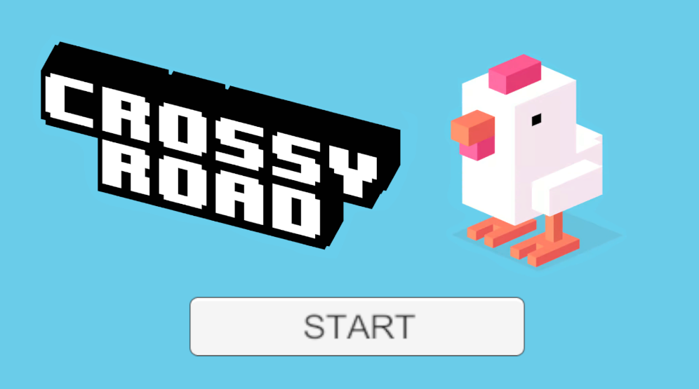
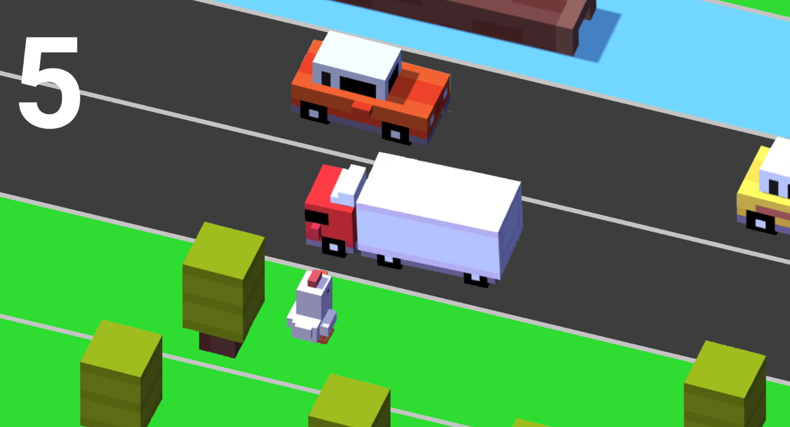

# Unity_CrossyRoad2D
A 2D endless runner game inspired by Crossy Road, made in Unity Game engine, focusing on obstacle spawning, player movement mechanics, and score-based progression.

This project was created as a Graduation project in 2024.

## Gameplay

- Player controls a character trying to cross roads
- Avoid moving obstacles (cars, trucks,trees etc.)
- The longer you survive, the higher your score

## Built With

- Unity (2D)
- C#
- Visual Studio / Rider

## Features

- Key controlled player movement
- Obstacle spawning system
- Score tracking system
- Increasing difficulty over time

## Screenshots

  
  

